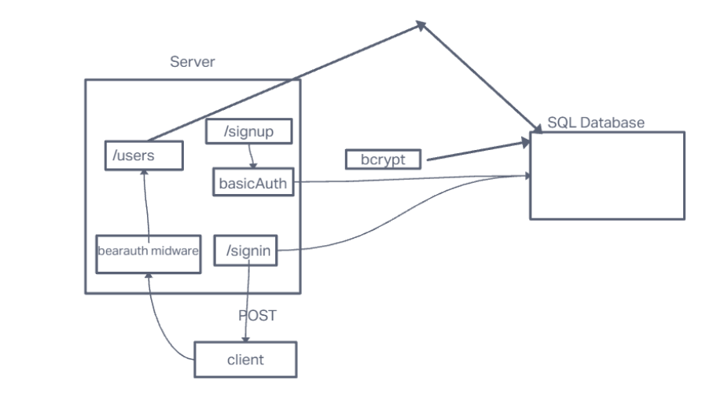

# LAB - Class 07

## Project: Bearer Authorization

### Author: Emmanuel Gonzales

### Problem Domain  

This is a server ment to demonstrate the process of baerer and basic auth

### Links and Resources

- [GitHub Actions ci/cd](https://github.com/Emmanuel-Gonzales/bearer-auth/actions)
- [back-end server url](https://bearer-auth-vee4.onrender.com)

### Collaborators

### Setup

#### `.env` requirements (where applicable)

PORT = `Port`
DATABASE_URL = `SQL DataBase`
SECRET = `Any-String`

#### How to initialize/run your application (where applicable)

`npm node index.js`

#### How to use your library (where applicable)

#### Features / Routes

- POST : `/signin`
- POST : `/signup`
- GET  : `/users`
- GET  : `/secret`

#### Tests

- npm test

#### UML

